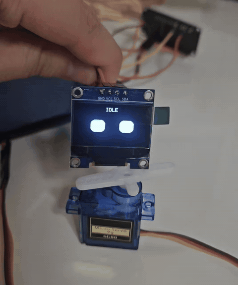

# ESP32 AI Robot Prototype

ESP32에 OLED 화면과 서보모터를 연결해 표정과 움직임을 만드는 인터랙티브 로봇 프로토타입입니다. 부품을 하나씩 시험한 뒤 통합하는 방식으로 진행하고 있습니다.

## Demo



[원본 영상 보기](media/oled_servo_integration_demo.mp4)

## 현재까지 성공한 단계

- ESP32를 Windows의 `COM6`에서 인식
- Arduino IDE에서 ESP32 보드로 스케치 업로드
- SSD1306 OLED에 글자 출력
- OLED에서 `IDLE`, `HAPPY`, `ANGRY` 얼굴 애니메이션 표시
- SG90 서보모터 단독 동작 테스트
- OLED 표정과 서보 움직임 통합 테스트

## 사용 부품

- ESP32 DevKit V1
- SSD1306 0.96인치 OLED (I2C, 128×64)
- SG90 서보모터
- 브레드보드와 점퍼선
- HC-SR04 초음파 거리 센서 (다음 단계)
- INMP441 I2S 마이크 (예정)
- MAX98357A I2S 앰프와 3W 4Ω 스피커 (예정)

## 현재 배선

### OLED SSD1306

| OLED | ESP32 |
|---|---|
| VCC | 3V3 |
| GND | GND |
| SDA | GPIO21 |
| SCL | GPIO22 |

### SG90 서보

| SG90 선 색상 | ESP32 / 전원 |
|---|---|
| 갈색 | GND |
| 빨간색 | 5V |
| 주황색 | GPIO13 (두 번째 서보는 GPIO14) |

서보를 여러 개 연결할 때는 안정적인 외부 5V 전원을 사용하는 것이 좋습니다. 외부 전원을 사용하면 외부 전원의 GND와 ESP32의 GND를 반드시 함께 연결해야 합니다.

## 실행 방법

1. Arduino IDE에서 `code/oled_2servo_integration_test/oled_2servo_integration_test.ino`를 엽니다.
2. 라이브러리 관리자에서 아래 라이브러리를 설치합니다.
   - Adafruit GFX Library
   - Adafruit SSD1306
   - ESP32Servo
3. ESP32 보드와 포트(`COM6`)를 선택합니다. 컴퓨터 환경에 따라 포트 번호는 달라질 수 있습니다.
4. 스케치를 업로드합니다.
5. OLED 표정이 바뀌고 서보가 움직이는지 확인합니다.

## HC-SR04 연결 전 주의

HC-SR04의 `ECHO` 핀은 약 5V 신호를 출력하지만 ESP32의 GPIO는 3.3V용입니다. `ECHO`를 ESP32에 직접 연결하지 말고, 저항 2개로 전압 분배 회로를 만든 뒤 연결해야 합니다.

예시:

```text
HC-SR04 ECHO ── 1kΩ ──┬── ESP32 입력 핀
                       │
                      2kΩ
                       │
                      GND
```

현재는 필요한 저항을 준비하기 전이라 HC-SR04 연결을 보류한 상태입니다.

## 프로젝트 구조

```text
esp32-ai-robot-prototype/
├─ README.md
├─ code/
│  └─ oled_2servo_integration_test/
│     └─ oled_2servo_integration_test.ino
└─ media/
   ├─ oled_servo_integration_demo.gif
   └─ oled_servo_integration_demo.mp4
```

## 다음 목표

- 서보모터 2개를 외부 5V 전원으로 안정적으로 구동
- HC-SR04를 전압 분배 회로와 함께 연결
- 측정 거리에 따라 OLED 표정과 서보 움직임 변경
- INMP441 마이크 입력 테스트
- MAX98357A 앰프와 스피커 출력 테스트
